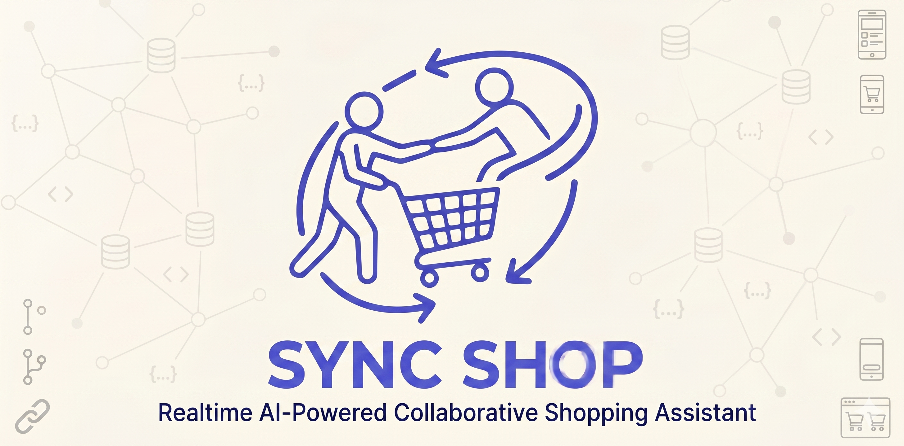
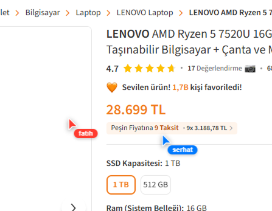
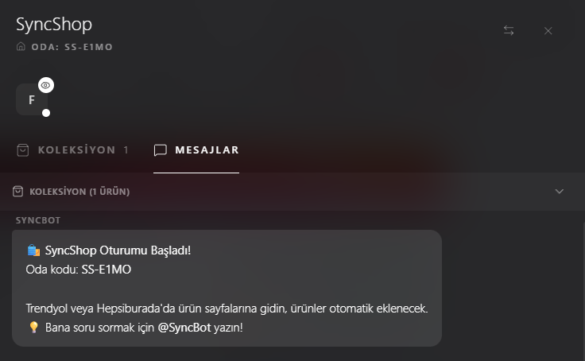
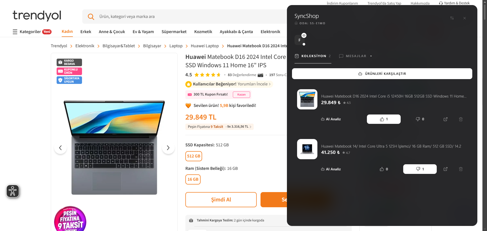
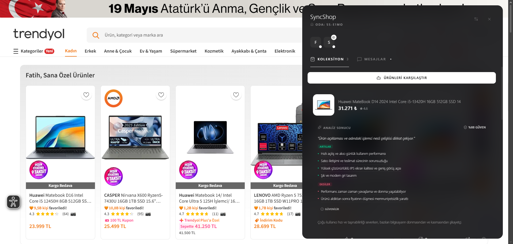
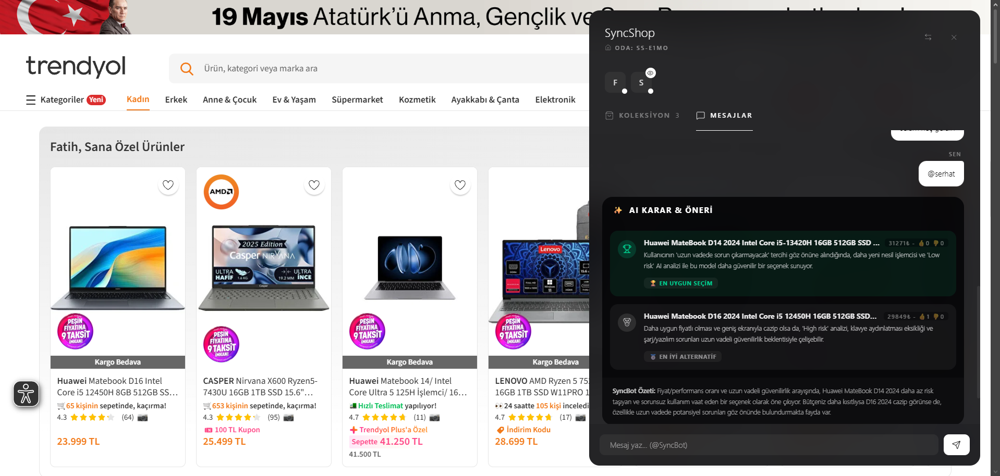

<div align="center">
  
  
  #  SyncShop
  
  **Realtime AI-Powered Collaborative Shopping Assistant**
  
  *BTK Hackathon 2026 için geliştirilmiştir.*

  


</div>

<br />

> **Alışverişi link çöplüğünden kurtarın; birlikte arayın, AI ile ortak karar verin.**

SyncShop; arkadaşlarınız veya ailenizle birlikte internetten alışveriş yapma sürecini (hediye seçimi, çeyiz hazırlığı, ev alışverişi vb.) WhatsApp link çöplüğünden kurtaran yenilikçi bir Chrome Eklentisi ve Socket ekosistemidir. Gerçek zamanlı, çok oyunculu (multiplayer) ve yapay zeka moderatörlüğünde premium bir alışveriş deneyimi sunar.

> **Not:** Şu an sadece Trendyol desteklidir. İlerleyen zamanlarda diğer e-ticaret siteleri de eklenecektir.

---

## 🎯 Neden SyncShop? (Problemin Çözümü)

**Problem:** Birden fazla kişinin dahil olduğu e-ticaret alışverişlerinde kararlar WhatsApp gruplarında sayısız ürün linkinin paylaşılmasıyla verilir. Kimin hangi ürünü beğendiği, ürünlerin karşılaştırması ve nihai karar süreci kaotiktir.

**Çözüm:** SyncShop ile kullanıcılar bir odaya katılır ve e-ticaret sitelerinde (örn. Trendyol, Hepsiburada) **aynı anda** gezinirler. Ürünler tek tıkla ortak bir sepete (koleksiyona) atılır, beraber oylanır ve karar verilemeyen durumlarda Yapay Zeka devreye girerek gruptaki bütçe, beklenti ve oylama verilerini analiz edip en mantıklı seçimi yapar.

---

## ✨ Öne Çıkan Özellikler

### 🖱️ 1. Multiplayer Cursors (Gerçek Zamanlı Mouse İmleçleri)
Aynı ürün sayfasında olan kullanıcılar birbirlerinin mouse imleçlerini ve hareketlerini ekranlarında anlık olarak görür.

- **Akıllı Çözünürlük Eşitleme:** Her kullanıcının ekran boyutu farklı olabileceği için koordinatlar merkez-odaklı (center-relative) olarak normalize edilir.
- **Süper Akıcı Çizim:** Tarayıcının yerel çizim döngüsü olan `requestAnimationFrame` ve donanım hızlandırmalı CSS transform'ları ile saniyede 20 kare (50ms) sıfır gecikmeli senkronizasyon.

### 🔗 2. Canlı Oda ve Ekran Senkronizasyonu
Odada bulunan bir kullanıcının anlık olarak hangi sitede, hangi ürünü incelediğini yan panelden takip edin. İsterseniz **"Yanına Git"** butonuna tıklayarak arkadaşınızın ekranına ışınlanın!



### 🤖 3. AI Seçim Asistanı & Moderatör
Grup olarak kararsız kaldığınızda **"AI'dan Seçim Asistanı İste"** butonunu kullanın. 


- AI, karşılaştırma için seçilen ürünlere göre dinamik olarak belirlenen soruları (kullanım amacı, bütçe, teknik ihtiyaçlar vb.) gruba yöneltir.
- 
- Gruptaki tüm kullanıcıların beğeni oylarına (👍/👎), fiyat/performans grafiklerine ve kullanıcı yorumlarına bakarak **en doğru, mantıklı kararı ve gerekçesini** gruba özetler.
- SyncShop Backend'i Trendyol API'lerine doğrudan bağlanarak ürün değerlendirmelerini çeker ve Gemini modelini besler.




### 💬 4. Dahili Sohbet (In-App Chat)
Sayfa değiştirmeden, ekranın köşesindeki cam görünümlü (Glassmorphism) modern panelden arkadaşlarınızla anlık olarak yazışın. Birini etiketlediğinizde (Mention) ona özel renkli bildirimler gider.

### 🔌 5. Akıllı Bağlantı & Zombie Session Koruması
Tarayıcı yanlışlıkla kapandığında veya sayfa yenilendiğinde (F5) "Ayrıldı/Katıldı" mesajlarıyla sohbet kirlenmez. Sunucu, kullanıcıyı otomatik olarak çevrimdışı (offline) moda alır ve 10 dakika boyunca odada kimse aktif olmazsa Supabase üzerinden odayı kalıcı olarak silip temizler.

---

## 🛠️ Teknolojik Altyapı (Architecture)

Projemiz modern web standartları ve performans gözetilerek tasarlanmıştır. 

### 🎨 Frontend (Chrome Extension)
- **Framework:** React + Vite
- **Tasarım Dili:** Glassmorphism
- **Mimari Not:** Chrome'un Content Script kısıtlamalarını aşabilmek adına Vite üzerinde özel bir **IIFE Bundle Pipeline** orchestrator kullanılmıştır.

### ⚙️ Backend (Socket & Rest Server)
- **Core Engine:**  Node.js / Express.js
- **Realtime Layer:** Socket.IO
- **Yapay Zeka (AI):** Google Gemini-2.0-flash.
- **Database:** Supabase (PostgreSQL).

---

## 🚀 Kurulum ve Çalıştırma (Jüri İçin)

### 1. Backend (Sunucu) Kurulumu
1. Terminalden `server` klasörüne girin: `cd server`
2. Paketleri yükleyin: `bun install` *(veya `npm install`)*
3. Bir `.env` dosyası oluşturup aşağıdaki API anahtarlarını tanımlayın:
   ```env
    PORT=3001
    AI_PROVIDER=gemini
    GEMINI_API_KEY=your_gemini_api_key_here
    SUPABASE_URL=https://xxx.supabase.co
    SUPABASE_KEY=sb_secret_key
   ```
4. Sunucuyu başlatın: `bun run dev` (veya `npm run dev`)

### 2. Eklentinin (Extension) Yüklenmesi
1. Terminalden `extension` klasörüne girin: `cd extension`
2. Paketleri yükleyin: `bun install`
3. Eklentiyi derleyin: `bun run build`
4. Tarayıcınızda (Chrome/Edge/Brave) `chrome://extensions` adresini açın.
5. Sağ üst köşedeki **"Geliştirici modu" (Developer Mode)** anahtarını açın.
6. Sol üstteki **"Paketlenmemiş öğe yükle" (Load unpacked)** butonuna tıklayın.
7. Bilgisayarınızdan `SyncShop/extension/dist` klasörünü seçin.

> 🎉 Tebrikler! Trendyol  üzerinde gezindiğinizde SyncShop arayüzü ekranın sağ tarafında otomatik olarak belirecektir.

---

## 👥 Geliştirici Ekibi

Bu proje **BTK Hackathon 2026** kapsamında geliştirilmiştir.

- **Fatih Kabul** - *Full-Stack Developer* - [GitHub](https://github.com/zamazincode) | [LinkedIn](https://linkedin.com/in/fatihkabul)
- **Serhat Arslan** - *Full-Stack Developer* - [GitHub](https://github.com/serhatx1) | [LinkedIn](https://linkedin.com/in/serhat-arslann)

---
<div align="center">
  <sub>SyncShop © 2026 | Birlikte Seçin, Birlikte Alın.</sub>
</div>
